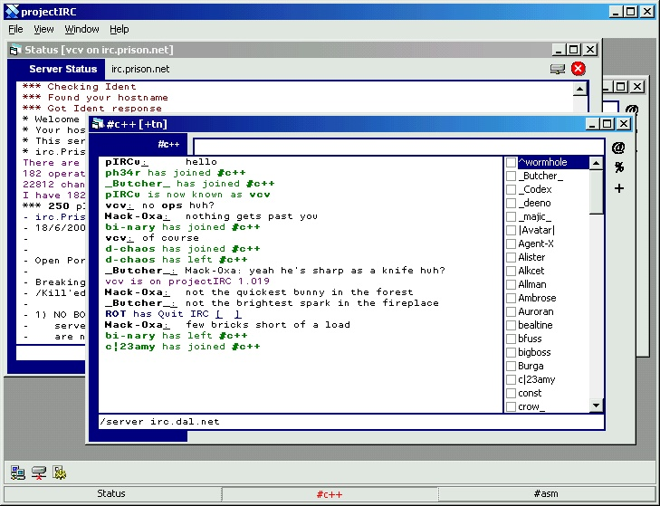



## projectIRC 1\.019 Update

### Description

Update to my original upload of projectIRC.

I added a few aliases, such as /server <server> <port>, where port is optional, $date and $time identifiers added. A few bug fixes.

Also! I added a nice little taskbar :)

Please leave comments.

Check out www.projectirc.com within a few days to see if its up, as soon as it is, I will put updates on there.
 
### More Info
 

             |
---                |---
**Submitted On**   |2000-09-23 12:29:02
**By**             |[vcv](https://github.com/Planet-Source-Code/PSCIndex/blob/master/ByAuthor/vcv.md)
**Level**          |Advanced
**User Rating**    |4.8 (19 globes from 4 users)
**Compatibility**  |VB 6\.0
**Category**       |[Complete Applications](https://github.com/Planet-Source-Code/PSCIndex/blob/master/ByCategory/complete-applications__1-27.md)
**World**          |[Visual Basic](https://github.com/Planet-Source-Code/PSCIndex/blob/master/ByWorld/visual-basic.md)
**Archive File**   |[CODE\_UPLOAD101019232000\.zip](https://github.com/Planet-Source-Code/vcv-projectirc-1-019-update__1-11636/archive/master.zip)

